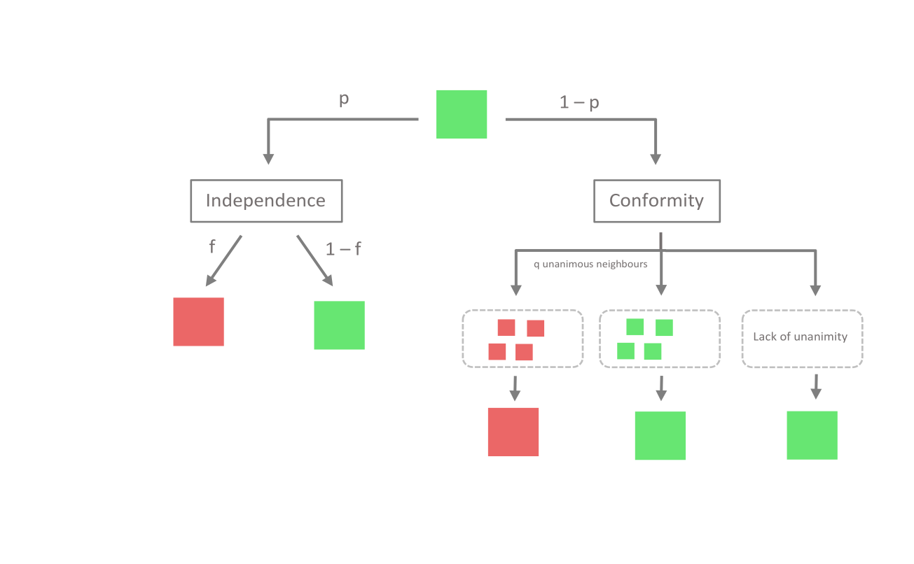

# q-voter model simulation
---

### Dash app designed for simple simulation and visualization of the q-voter model on a square network.
User can see in real time how the system is evolving and how the average opinion is changing.

❯❯❯❯❯  **App deployed on Heroku: https://q-voter.herokuapp.com/**

---
### User manual

---

