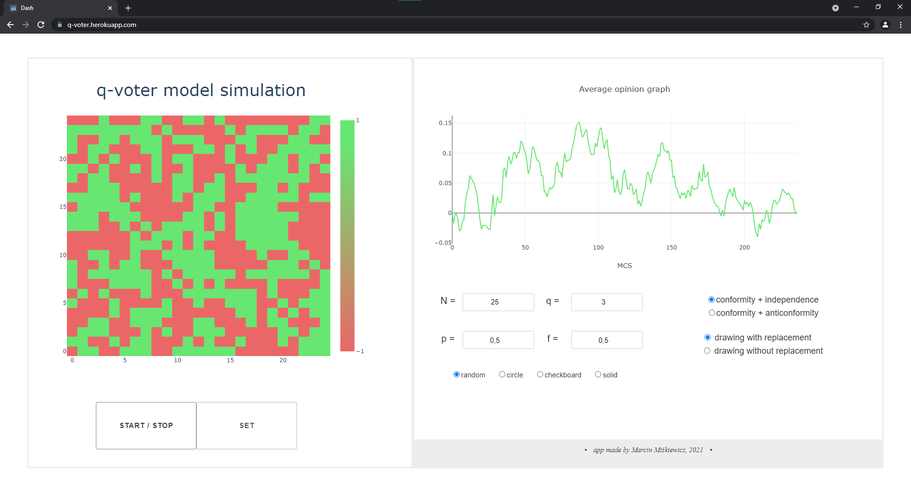

# q-voter model simulation 🟩🟥🟩🟥
---

### Dash app designed for simple simulation and visualization of the q-voter model on a square network.
User can see in real time how the system is evolving and how the average opinion is changing.

❯❯❯❯❯  **App deployed on Heroku: https://q-voter.herokuapp.com/**

---

website screenshot

  
---

The application enables simulations of two versions of the model: independence + conformity and anticonformity + conformity.
The difference in the opinion dynamics algorithms is presented in the diagrams below. An intuitive and accessible description of the algorithms can be found e.g. in 
  
>[1] Nail, Paul & Sznajd-Weron, Katarzyna. (2016). The Diamond Model of Social Response within an Agent-Based Approach. Acta Physica Polonica A. 129. 1050-1054. 10.12693/APhysPolA.129.1050.

---
  

independence + conformity

  
---
  

anticonformity + conformity

 ### Parameters
  
🟩 `N` - system size
  
🟩 `p` - probability of a non-conforming behaviour of an agent
  
🟩 `q` - number of neighbours to check (max 8: 4 on the sides and 4 in the corners)
  
🟩 `f` - probability of independence (it matters only when the selected model is with independence)
  
🟩 `radio buttons: drawing w/o replacement` - decides whether randomly selected neighbors can be repeated
  
🟩 `radio buttons: random/circle/solid/checkboard` - initial state of the system
  
 After setting the parameters, click the `SET` button and then run the simulation by clicking `RUN\STOP`!
 
 ---
