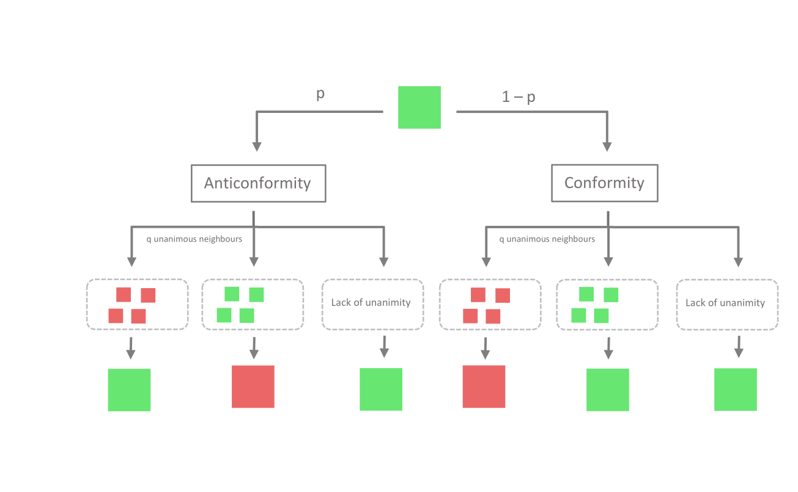

# q-voter model simulation
---

### Dash app designed for simple simulation and visualization of the q-voter model on a square network.
User can see in real time how the system is evolving and how the average opinion is changing.

❯❯❯❯❯  **App deployed on Heroku: https://q-voter.herokuapp.com/**

---

*website screenshot*

---
### User manual

The application enables simulations of two versions of the model: independence + conformity and anticonformity + conformity.
The difference in the opinion dynamics algorithms is presented in the diagrams below. An intuitive and accessible description of the algorithms can be found e.g. in 
  
>[1] Nail, Paul & Sznajd-Weron, Katarzyna. (2016). The Diamond Model of Social Response within an Agent-Based Approach. Acta Physica Polonica A. 129. 1050-1054. 10.12693/APhysPolA.129.1050.

*independence + conformity*

*anticonformity + conformity*
